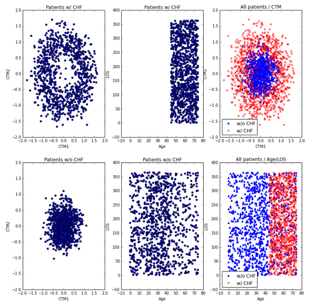

# Visualization Lab #

For this lab, we'll focus on the same dataset that will be used in a later lab
and generate some plots of the underlying data.  While you'll gain direct
experience with using subplots, while also seeing that sometimes plotting can
be very helpful with feature selection or understanding your data better.

## Part 1

### The Short Version
Generate a plot that looks like the following:


### The Long Version

You will be reading in the data.csv file (same exact file as the last lab) and
generating several plots within a single figure.  Your figure will contain 6
subplots of 2 rows and 3 columns.  The top row will be the following plots
from left to right:

1. Patients with CHF, CTM2 vs. CTM1
2. Patients with CHF, LOS vs. Age
3. All patients, CTM2 vs. CTM1 where the color and markers for CHF and non-CHF
   patients differ

The bottom row will be the following plots:

1. Patients without CHF, CTM2 vs. CTM1
2. Patients without CHF, LOS vs. Age
3. All patients, LOS vs. Age where the color and markers for CHF and non-CHF
   patients differ

More requirements:

1. All of the plots of CTM1 and CTM2 should share the same scale for the X and Y
   axes
2. All of the plots of Age and LOS should share the same scale for the X and Y
   axes
3. CTM2 should be the Y-axis and CTM1 should be the X-axis within the respective
   subplots
4. LOS should be the Y-axis and Age should be the X-axis within the respective
   subplots
5. Add a legend for the two subplots that contain data from all patients

## Part 2

For this next part, you will be responsible for writing and committing your own
code.  However, you will also work within your groups to decide what specific
variables to plot.  The goal is for you and your partner(s) to explore and plot
different aspects of the data.  Everyone should be submitting different plots.

You will also be comparing your own plots with that of everyone else in your
group and submitting a short compare/contrast writeup.  The goal is to see what
your plots tell you about the data that your partners' plots do not (and vice
versa).  

### Specifics

1. Download and use Pandas to read in the following dataset: http://archive.ics.uci.edu/ml/datasets/Echocardiogram
2. Choose some features to plot (these should be different from your group members)
3. You can use a similar approach to part I or you may get creative.  The intent is for you to explore the dataset using visualization as your primary tool.  Please also refer to the reading for other ideas on plotting
4. Submit a ~1 page writeup comparing your plots to those from your team.  What do your plots tell you about the data that the other plots do not?  Does comparing your plots to others give you ideas on what else to plot?  Is visually exploring the data useful?  Why or why not?

## Final Comments

Again, please make sure to do all of your work in a `dev` branch.  Submit only
one (1) pull request.  DO NOT MERGE your pull request.

Please also add your generated plots to a directory within the repo named
`images`.  I will also be running your code to generate the images.

Please do your work in a file named `viz.py`.  I will be running your code using the following command:

```
python viz.py
```

And, your code shall generate plots that are displayed to the screen.  These
plots shall match the ones that you add to the repo.  Please be careful to use
relative paths since my directory structure is going to be different than
yours.
